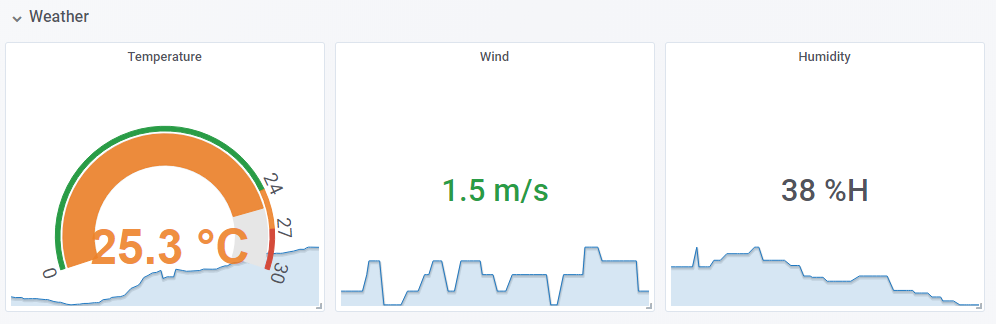

[](https://github.com/joonas-fi/weather2prometheus/releases)

Get weather data in Prometheus from AWS Lambda.




How to deploy
-------------

Follow the same instructions as in [Onni](https://github.com/function61/onni).

```
$ version="..."; deployer deploy weather2prometheus "https://dl.bintray.com/joonas/dl/weather2prometheus/$version/deployerspec.zip"
```
